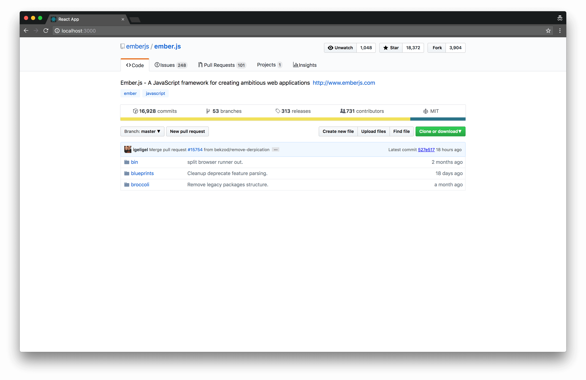

# React GitHub Project Page by [igeligel](https://github.com/igeligel)

> A simple clone of the GitHub project page done in React with styled-components.
> All components will be published to npm soon.

<a href="./License.md"></a>
<a href="https://github.com/igeligel/react-github-project-page/pulls"></a>
[](https://github.com/prettier/prettier)
<a href="https://github.com/igeligel/react-github-project-page/stargazers"></a>

## Showcase/Architecture



## Installation

```bash
yarn install
# or using npm
npm install
```

To run the example use:

```bash
yarn start
# or using npm
npm start
```

## Contact

<a href="https://twitter.com/kevinpeters_"></a>

## Contributors

<table><thead><tr><th align="center"><a href="https://github.com/igeligel"><br><sub>igeligel</sub></a><br><p>Contributions: 23</p></th></tbody></table>

## License

_react-github-project-page_ is realeased under the [MIT License](./LICENSE).
